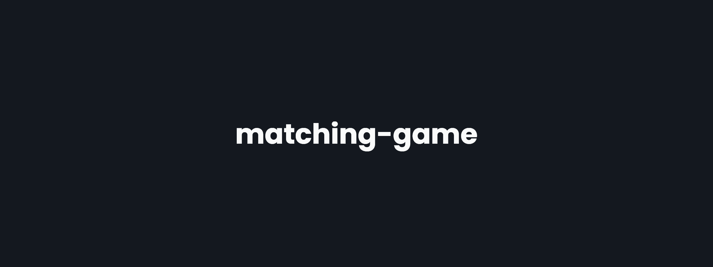

<!-- markdownlint-disable MD014 -->
<!-- markdownlint-disable MD026 -->
<!-- markdownlint-disable MD033 -->
<!-- markdownlint-disable MD041 -->

<h1 align="center">
  matching-game
</h1>

<!-- Banner Section -->

  

<h3 align="center">
  Matching Game
   
   
  <a href="https://matching-game-sveltekit.vercel.app">
    Click to visit the website
  </a>
</h3>

---

<!-- Badges Section -->

  
  
  
  </a>
  

---

<!-- Translations Section -->

<!-- ## 🌎 Translations -->

<kbd></kbd>
<kbd></kbd>

<!-- Introduction Section -->

## 📖 Introduction

This is a simple matching game made with SvelteKit and TypeScript.

<!-- Features Section -->

## 🚀 Features

- Match cards with the same image
- Pause option
- Restart option
- Timer
- Attempts

<!-- Technologies Section -->

## 🧰 Technologies

- [⚛ SvelteKit](https://kit.svelte.dev)
- [🔷 TypeScript](https://typescriptlang.org)
- [🎨 Sass](https://sass-lang.com)
- [⛔ ESLint](https://eslint.org)
- [🎀 Prettier](https://prettier.io)
- [🎊 neoconfetti](https://github.com/puruvj/neoconfetti)

<!-- License Section -->

## 📜 License

This project is licensed under the **MIT License** - see the [LICENSE](../../../LICENSE) page for details.

<!-- Acknowledgment Section -->

---

### ❤️ Thanks for your attention!
