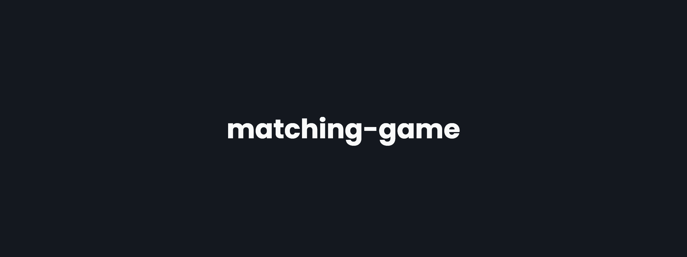

<!-- markdownlint-disable MD014 -->
<!-- markdownlint-disable MD026 -->
<!-- markdownlint-disable MD033 -->
<!-- markdownlint-disable MD041 -->

<h1 align="center">
  matching-game
</h1>

<!-- Seção de Banner -->

  

<h3 align="center">
  Matching Game
   
   
  <a href="https://jogo-de-memoria-sveltekit.vercel.app">
    Clique para visitar o site
  </a>
</h3>

---

<!-- Seção de Badges -->

  
  
  
  </a>
  

---

<!-- Seção de Traduções -->

<!-- ## 🌎 Traduções -->

<kbd></kbd>
<kbd></kbd>

<!-- Seção de Introdução -->

## 📖 Introdução

Este é um jogo de memória simples feito com SvelteKit e TypeScript.

<!-- Seção de Recursos -->

## 🚀 Recursos

- Combinação de cartas com a mesma imagem
- Opção de pausa
- Opção de reiniciar
- Cronômetro
- Tentativas

<!-- Seção de Tecnologias -->

## 🧰 Tecnologias

- [⚛ SvelteKit](https://kit.svelte.dev)
- [🔷 TypeScript](https://typescriptlang.org)
- [🎨 Sass](https://sass-lang.com)
- [⛔ ESLint](https://eslint.org)
- [🎀 Prettier](https://prettier.io)
- [🎊 neoconfetti](https://github.com/puruvj/neoconfetti)

<!-- Seção de Licença -->

## 📜 Licença

Este projeto está licenciado sob a **Licença MIT** - veja a página [LICENSE](../../../LICENSE) para mais detalhes.

<!-- Seção de Agradecimentos -->

---

### ❤️ Obrigado pela sua atenção!
